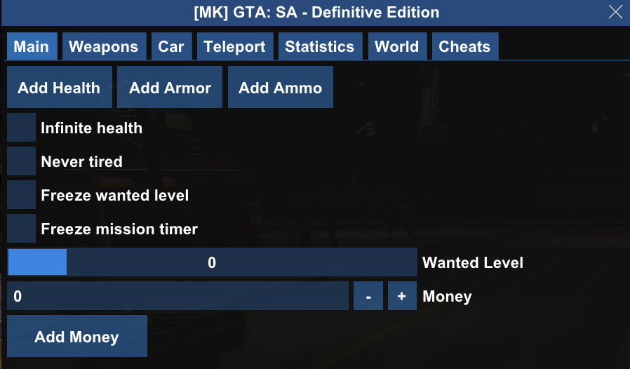
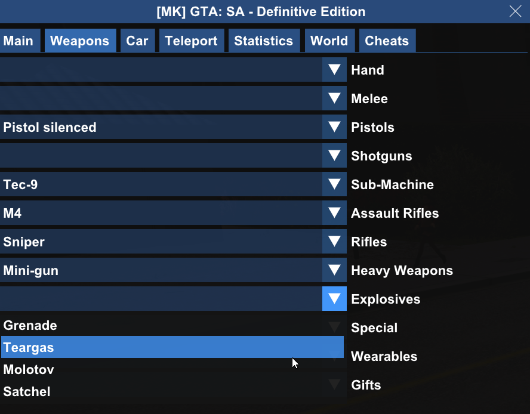
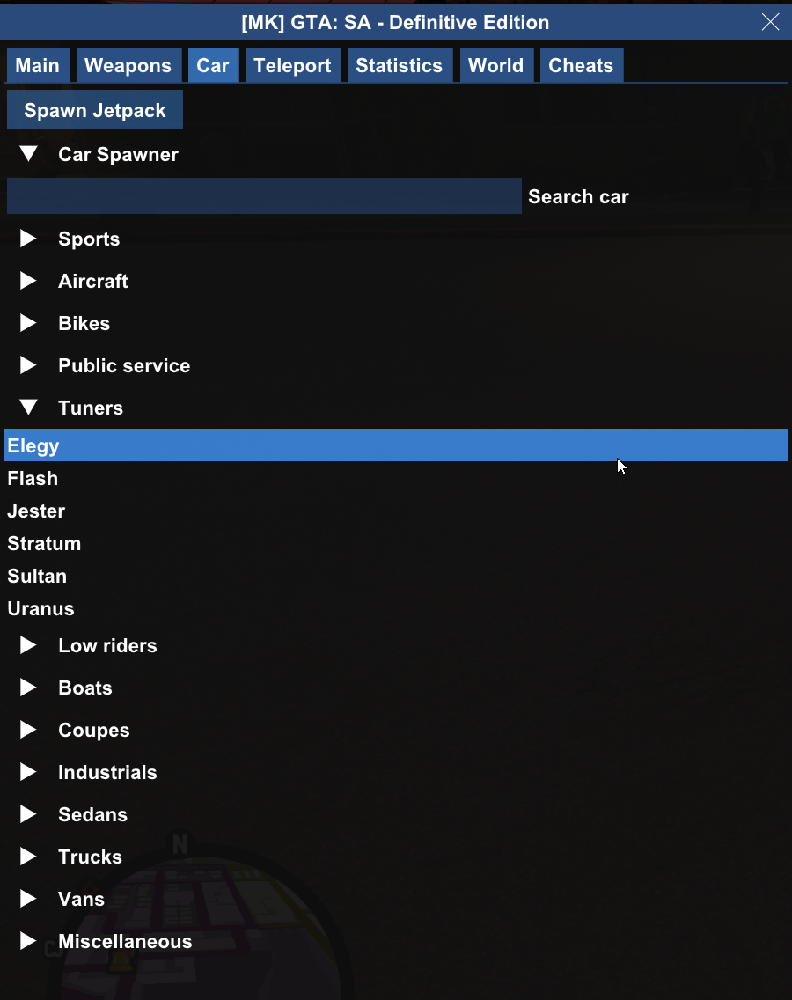
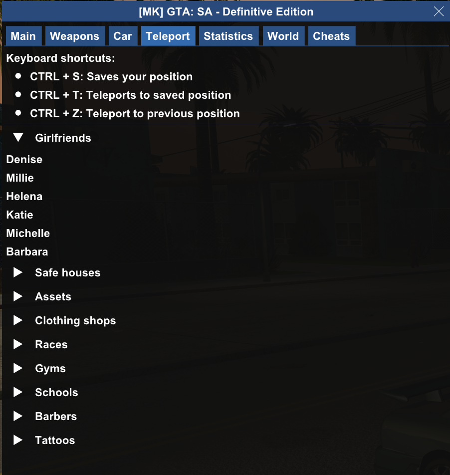
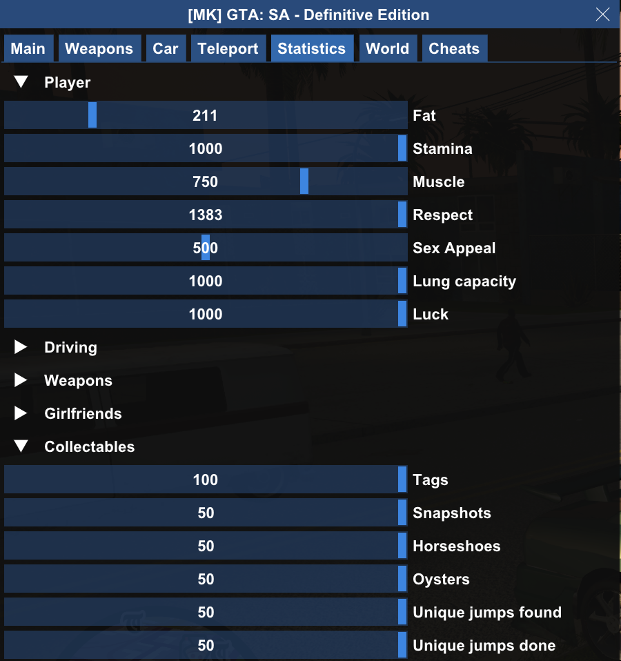
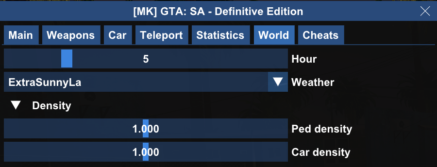
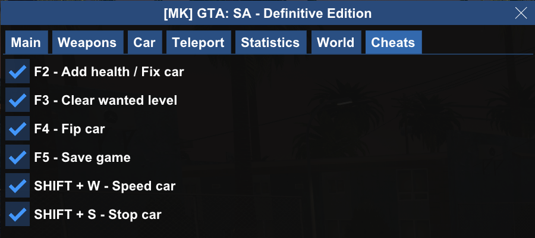

# GTA SA: Definitive Edition - Cheat Menu mod

## Installation

1. Install [CLEO Redux](https://re.cleo.li/) version ^1.2.2
2. Copy mod directory to CLEO library `...\GTA San Andreas - The Definitive Edition\Gameface\Binaries\Win64\CLEO\cheat-menu`

## Usage

Press `F1` key in game to open/close the menu.

## Features

### Main

### Weapons

### Car

*  Spawner

* Tuning

### Teleports

### Statistic editor

### World editor

### Cheats

## Credits

Thanks to:
* [Map Genie](https://mapgenie.io/grand-theft-auto-san-andreas/maps/san-andreas) for providing all teleport locations.
* [GTA Fandom](https://gta.fandom.com) for car colors.
* [Wiki MultiTheftAuto](https://wiki.multitheftauto.com) for all object IDs.

### Known Bugs

* After alt-tab, the menu is no longer visible
* Car hydraulics mod cannot be removed, but this may be inherent to how the game works.
* Car colors may not apply correctly; unfortunately, I couldn't find a reliable source defining supported car color IDs.
* Teleports in GTA Vice City sometimes freeze script; simply reload with Ctrl + Space + R

## Contributing

Feel free to contribute by reporting issues or creating pull requests.

## License

This mod is licensed under the [ISC License](LICENSE).

